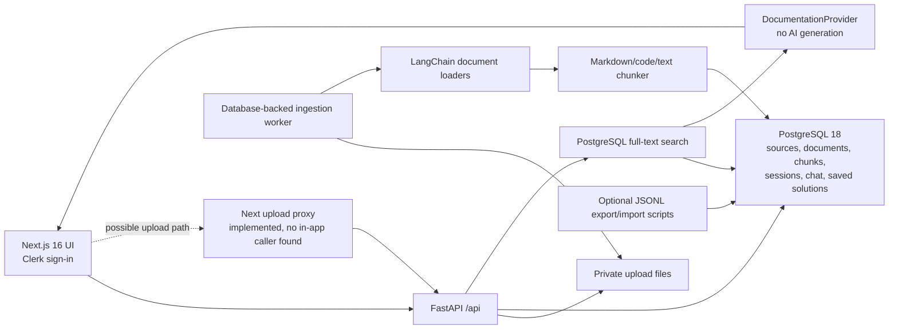
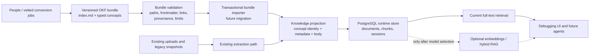

# FixFlow OKF migration audit and plan

This audit describes the repository as inspected on 2026-09-30. It uses the canonical [Open Knowledge Format v0.2 specification](https://github.com/GoogleCloudPlatform/open-knowledge-format/blob/main/SPEC.md). OKF defines a bundle of Markdown concepts with YAML frontmatter; `type` is the only always-required concept field. The optional root `index.md` can declare `okf_version`. OKF does not prescribe a database, embedding model, or runtime. The proposal below keeps those concerns explicit.

## Current architecture



### Module and feature inventory

| Area | Implementation | Current use |
| --- | --- | --- |
| Frontend routes and layout | `src/app/{page,sources,history,saved,settings}/`, `src/components/` | Active UI for debugging input, knowledge sources, sessions, saved solutions, settings, and theme |
| Frontend API and auth | `src/lib/api.ts`, `src/proxy.ts`, Clerk pages; `src/app/api/documents/route.ts` | Direct browser-to-FastAPI calls are active. The authenticated Next upload proxy is implemented and tested, but no current UI call to it was found. Clerk protects frontend entry, not FastAPI records. |
| API boundary | `backend/main.py`, `backend/api/routes.py`, `backend/schemas/models.py` | Active health, upload, source status, debug, chat, history, and saved-solution endpoints |
| Upload and job control | `backend/services/uploads.py`, `backend/services/ingestion.py` | Active validation, private file storage, persisted status, retries, advisory locking, and transactional ingestion |
| Extraction and chunking | `backend/processing/loaders.py`, `backend/processing/chunking.py` | Shared by the live worker and optional offline commands after this refactor |
| OKF concept parsing | `backend/processing/okf.py` | Recognizes valid standalone uploaded Markdown concepts; preserves frontmatter in document/chunk metadata |
| Persistent corpus | `backend/db/models.py`, `backend/repositories/{corpus,sources,retrieval}.py`, migration `0001` | PostgreSQL source, document, chunk, full-text index, and deduplication; JSONB metadata |
| Debugging workflow | `backend/services/{diagnosis,store}.py` | Keyword evidence browsing, saved requests/conversation, saved solutions; no model-generated diagnosis |
| Vector seam | `backend/repositories/vectors.py` | Implemented and tested repository interface, but no production embedding generation or vector retrieval |
| Legacy data tools | `scripts/{ingest_documents,chunk_documents,import_jsonl_to_db}.py` | Optional offline JSONL export and restartable import. The importer remains necessary for existing snapshots. |
| Deployment and checks | `compose.yaml`, Dockerfiles, Alembic, `pyproject.toml`, `tests/`, `backend/tests/`, `scripts/tests/` | Active local deployment, migration, and quality gates |

There is no evidence that a tracked source module is safely deletable. The old script modules are not redundant runtime implementations: their reusable loader/chunker logic is now extracted, while the commands remain for existing offline workflows. The vector repository is dormant in production but is an intentional future integration seam. Generated and private files under `doc/`, `.local/`, `node_modules/`, `myenev/`, and `.next/` are not source cleanup targets.

### Current document workflow

1. `POST /api/documents` accepts upload or pasted content and responds `202` after source registration. URL references may be registered, but remote fetching is unconfigured and those sources report `failed`.
2. `uploads.py` validates extension and size (50 MB maximum), hashes the bytes, and stores a private file under a generated directory. Duplicate bytes reuse the source; failed sources can be retried.
3. The worker scans persisted `uploaded`, `processing`, and `chunked` jobs. A transaction advisory lock coordinates concurrent workers; input is checked against the upload directory.
4. A format-specific loader extracts text. For valid standalone OKF Markdown, `okf.py` reads frontmatter and passes only the concept body to chunking. Ordinary Markdown follows its previous path.
5. `corpus.py` writes documents and heading-aware or text/code-aware chunks, with source and document metadata, in batches in one transaction. Errors roll back documents/chunks and record a safe `failed` state. Successful jobs end at `ready_for_embedding`.
6. `document_chunks.search_text` is a generated PostgreSQL `tsvector` with a GIN index. `retrieval.py` uses keyword/full-text search for debug and follow-up requests.
7. The `embedding` field remains NULL. `vectors.py` is an unused production interface until an embedding model and dimension are selected. `DocumentationProvider` returns retrieved evidence and explicitly reports that AI generation is not connected.

PostgreSQL is the source of truth for persisted app state. Uploaded originals live in private file storage. Optional JSONL snapshots under `doc/processed/` are neither the live index nor the primary store.

## Proposed OKF-ready architecture



A versioned OKF bundle would be the reviewed, portable artifact for authored knowledge. PostgreSQL would remain the authoritative runtime store for source/job state, index projections, sessions, chat, and saved solutions. The current `knowledge/` bundle demonstrates the file layout; the application does not automatically import it.

### Change decisions

| Component | Decision | Reason |
| --- | --- | --- |
| File loaders and chunker | Keep, now shared under `backend/processing/` | Existing PDF, HTML, DOCX, CSV, text, and code workflows work and remain needed for non-OKF input. |
| Markdown concept handling | Add bounded OKF parser; preserve unknown frontmatter keys under `metadata.okf` | Prepares structured knowledge without a schema migration or API break. Standalone upload concept IDs are scoped to their source. |
| PostgreSQL models and migration `0001` | Keep unchanged in this step | JSONB can hold the metadata envelope. A proper bundle identity/version model needs a separate additive migration when bundle import is implemented. |
| Source status, retry, deduplication, private upload files | Keep unchanged | These protect data integrity and safe processing. |
| Keyword retrieval and documentation provider | Keep unchanged | Working retrieval is truthful. OKF is a knowledge representation, not an embedding or AI service. |
| Vector repository | Retain as dormant seam | Removing it would discard tested future integration work; no model is configured. |
| Offline JSONL commands/importer | Retain; do not auto-run | Existing snapshots may need migration. Shared logic has moved to the backend processing layer. |
| Existing public API and frontend | Keep unchanged | No new user-facing feature is required for preparation. |
| Dependencies | Add direct PyYAML requirement for OKF parsing; retain loader dependencies | PyYAML is already present in the development lock. Other loader packages are active or may support current document formats, so removal needs format-by-format testing. |

## Migration sequence

1. **Completed here:** Extract shared processing from CLI scripts, add a strict OKF concept parser with a legacy Markdown fallback, carry full frontmatter through existing JSONB metadata, add an example `knowledge/` bundle, and test standalone upload persistence. The original file remains available for future reprocessing.
2. **Define bundle ingestion contract:** Decide where reviewed bundles live, who can write them, how bundle versions are named, and whether imports are manual or watched. Treat Markdown and embedded links as untrusted data. Avoid executing OKF computation instructions.
3. **Add an additive Alembic migration:** Store bundle ID/version, concept path, source hash, and import revision separately from content hashes. Preserve existing source/document/chunk IDs and data. Establish unique keys scoped to a bundle and an update/deprecation policy before writing the importer.
4. **Build bundle validation/import:** Validate reserved `index.md`/`log.md`, required `type`, frontmatter size, safe paths, provenance links, and per-concept failures. Import in transactions and derive the same retrieval projection used today. Do not claim a raw uploaded Markdown file is a complete bundle.
5. **Migrate existing knowledge deliberately:** Inventory originals and JSONL snapshots; map each retained document to a reviewed concept, title, type, and provenance. Do not automatically promote chunks into authoritative concepts or invent verification.
6. **Compare and cut over:** Run old and OKF projections side by side on a disposable or backed-up database; compare counts, source attribution, keyword retrieval, retries, and UI behavior. Switch the read path only after parity, then retire a legacy path once its consumers and data have been migrated.
7. **Future optional AI/RAG:** Select an embedding model/dimension and retrieval semantics separately. A real diagnosis provider and backend authorization require their own designs and tests.

## Review findings and limitations

- **Architecture:** The backend previously imported reusable processing functions from offline CLI scripts. That coupling is removed. The new `backend/processing/` layer is the shared normalization/projection boundary.
- **Security:** Upload path checks, private file permissions, size limits, safe errors, CORS constraints, transactional writes, and advisory locks remain in place. YAML uses `safe_load` with frontmatter, depth, node, and cycle limits. The FastAPI API still has no token verification or per-user isolation, so this remains a local single-user service.
- **Data integrity:** The existing `0001` migration is untouched. No database tables or private corpora were deleted. A single uploaded Markdown concept does not retain bundle hierarchy or relative-link resolution; bundle import needs the planned identity schema.
- **Product truth:** No embeddings, reranker, remote fetcher, repository analysis, or model-generated diagnosis were added. Status remains `ready_for_embedding` after chunk persistence.
- **Dependency review:** `langchain-community` emits a deprecation warning but still supplies the active loaders; a replacement must be verified per format before removal. PyYAML is a direct dependency for new parsing and already appears in `requirements-dev.lock.txt`.
- **Cleanup:** No tracked files were intentionally deleted in this change. `doc/README.md` disappeared independently during the audit and was left untouched.

## Resulting layout

```text
backend/
  processing/
    loaders.py       shared file loader selection
    chunking.py      shared retrieval chunk projection
    okf.py           bounded OKF concept parser and metadata envelope
  repositories/      PostgreSQL persistence and retrieval
  services/          upload, ingestion jobs, diagnosis, sessions
knowledge/
  index.md           OKF bundle index
  current-knowledge-pipeline.md
docs/
  okf-migration.md   this audit and staged plan
scripts/             optional offline JSONL commands and importer
doc/                 local, ignored raw corpus and generated snapshots
```
